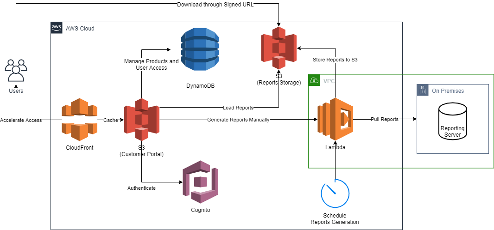
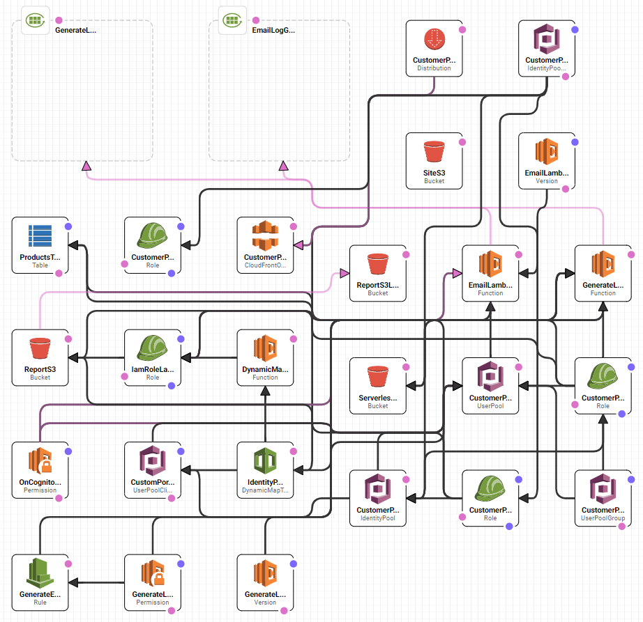

# AWS Serverless

This demo is extracted from a customer project. It demonstrates how to set up a serverless Web application in AWS. The infrastructure is fully automated by CloudFormation, which can be reused by other AWS projects. With the help from Serverless Framework, the whole application can be deployed and run without opening AWS Management Console. AWS CodeBuild and CodePipeline are used for CI/CD. Web frontend is powered by Angular 8, Angular Material, and Amplify. Fine-grained roles are secured by Cognito.

## Project at a glance

* **Type:** Demo / Template
* **Status:** In Production
* **Package:** N/A
* **CI Build:** AWS CodeBuild, AWS CodePipeline

## Tech stack

[.NET Core 2.2](https://dotnet.microsoft.com/download/dotnet-core/2.2) for AWS Lambda

[Node.js 10.x and npm 6.9.x](https://nodejs.org/en/download/) toolchain for deployment and frontend development 

[Serverless Framework](https://serverless.com/framework/docs/getting-started/) and [AWS CLI](https://aws.amazon.com/cli/) for deployment

[Angular 8](https://angular.io/) for Web frontend

[AWS SDK for JavaScript in the Browser](https://aws.amazon.com/sdk-for-browser/) for frontend to access AWS resources

[Amplify Framework](https://aws.amazon.com/amplify/framework/) for frontend authentication and UI components

## Getting started

More detailed instructions can be found under Development section. These are minimum steps required to set up a local development environment.

* Run `build.cmd` within `Services\Services` folder.
* Run `serverless deploy` within root folder.
* Update web application configs at  `Web\environment.ts`.
* Run `npm run start` within `Web` folder.

# Development

## Folder structure

- `Services`: AWS Lambda services
- `Web`: Angular web app
- `Root`: configurations for Serverless framework and AWS CodeBuild

## Services

Report and email Lambda function is developed using .NET Core. The source is under "Services" folder.

### Useful commands

* Build the .NET Core project into binary file:

    Run `build.cmd` **within** `Services\Services` folder.

    The generated files are stored in "Services\Services\bin\release\netcoreapp2.1" folder. "Services.zip" will be uploaded to AWS Lambda at deployment time. 

## Web

Frontend is developed using Angular 8 and TypeScript. The source is under "Web" folder.

### Configuration files

`environment.ts` file hardcodes configs required by Frontend application at development time. By default it is pointed to AWS development resources.

`environment.prod.ts` file is a template for configs required by Frontend application at build / deployment time. Placeholders in `#{value}` syntax will be replaced by different values by AWS CodeDeploy for different environments.

Note: Envionment variable values used by CodeBuild can be found at `buildspec.yml` and `buildspec-release.yml` files under root folder.

### Useful commands

* Run local development server:

    Run `npm run start` within `Web` folder.

* Run test:

    Run `npm run test` within `Web` folder.

* Build production package:

    Run `npm run build` within `Web` folder.

    The generated files are stored in "Web/dist" folder.

## Serverless, CloudFormation and CodeBuild

Root folder stores configurations for Serverless framework and AWS CodeBuild.

### Configuration files

`serverless.yml` defines infrastructure using [Serverless Framework](https://serverless.com/). This file will be converted to a full CloudFormation template by Serverless.

`env.yml` defines environmental variables that's different between development and production environment. These variables will be merged into above `serverless.yml` file during deployment.

The naming convetion is to have "dev" for all development resources, "release" for all production / release resoruces.

More environment can be defined in `env.yml` and can be deployed by using `serverless deploy --stage {stageName}`.

Note: These settings are for AWS services only. Frontend settings are defined in its own config files.

### Useful commands

Full documentation can be found at [serverless framework](https://serverless.com/). This section will only list some frequently used commonds that help developers.

* Deploy built .NET Core package to AWS (Lambda and other AWS services):

    Run `serverless deploy` within root folder (for development environment).

    Run `serverless deploy --stage release` within root folder (for release / production environment).

* Exam generated CloudFormation template without deploying to AWS:

    Run `serverless package` within root folder (for development environment).

    Run `serverless package --stage release` within root folder (for release / production environment).

    The generated files are stored in ".serverless" folder.

* Print deployed stack outputs:

    Run `serverless info --verbose` within root folder.

As AWS Lambda function run in AWS, it is hard to debug using IDE. You have to print all output to console and read logs from CloudWatch. So it is quicker to modify source code, run `build.cmd` then `serverless deploy` to speed up development cycle.

## Customisation

### Invitation Email

Update `Services\Services\Features\Email\EmailHandler.cs`.

### Disabled account message

Update `Web\src\app\login\login.component.ts`.

### No products to access message

Update `Web\src\app\reports\reports.component.html`.

### Sample IFrame container page

`Web\src\iframe.html`

# Infrastructure

## Diagrams

### Infrastructure

### CloudFormation

## Clean up existing stack

Do not manually delete any resource defined in the stack. This will confuse CloudFormation and might bring the entire stack to a non-recoverable state.

Relevant S3 buckets need to be emptied before deleting stack. This includes report bucket, report Logs bucket, web site static files bucket, and serverless deployment bucket.

Then go to CloudFormation and delete the stack.

## Create new stack

Trigger auto deployment by pushing changes to master or release branch, or manually deploy with `serverless deploy` command.

## Manual changes after new stack is created

### CloudFront

All CloudFormation deployment involves CloudFront is time consuming. It is recommended to comment out either entire `CustomerPortalDistribution` section, or just `Aliases` section under `CustomerPortalDistribution` to speed up initial deployment. Once the new CloudFront distribution is created, copy the domain of the new CloudFront distribution (e.g. d1skr47d3mqmaa.cloudfront.net) and set up DNS alias.

### DNS

CNAME alias needs to be configured for the new CloudFront distribution. This [link](https://docs.aws.amazon.com/AmazonCloudFront/latest/DeveloperGuide/CNAMEs.html#alternate-domain-names-restrictions) includes general information on setting up Custom URL / Alias on CloudFront. This [link](https://aws.amazon.com/premiumsupport/knowledge-center/resolve-cnamealreadyexists-error/) explains CNAMEAlreadyExists error. 

After DNS alias is pointed to the new CloudFront distribution, uncomment `Aliases` section under `CustomerPortalDistribution`.

### Update configs for web app

The new stack will output id of created resources. These ids need to be filled into `Web\environment.ts` and `buildspec.yml` (or `buildspec-release.yml`).

## User Management

### Add initial user

The first user needs to be added by using AWS CLI, as the AWS Console does not support entering custom attributes such as names, company, site, and account manager, which are required properties.

Supported values for sites are "A B", "C", "N", and "S".

`aws cognito-idp admin-create-user --user-pool-id {pool-id} --username {email} --user-attributes Name="email",Value="{email}" Name="email_verified",Value="true" Name="given_name",Value="{given name}" Name="family_name",Value="{family name}" Name="custom:company",Value="{company}" Name="custom:site",Value="{site}" --message-action SUPPRESS --desired-delivery-mediums=EMAIL --temporary-password "{temporaray / inital password}"`

e.g.

`aws cognito-idp admin-create-user --user-pool-id ap-southeast-2_WiNMlKiHH --username tianfei.chen@readify.net --user-attributes Name="email",Value="tianfei.chen@readify.net" Name="email_verified",Value="true" Name="given_name",Value="Tianfei" Name="family_name",Value="Chen" Name="custom:company",Value="Readify" Name="custom:site",Value="A B" --message-action SUPPRESS --desired-delivery-mediums=EMAIL --temporary-password "password"`

### Make the first user an admin

Once the user account is created, it needs to be prompted to be an `admin`.

`aws cognito-idp admin-add-user-to-group --user-pool-id {pool-id} --username {email} --group-name {group}`

e.g.

`aws cognito-idp admin-add-user-to-group --user-pool-id ap-southeast-2_WiNMlKiHH --username "tianfei.chen@readify.net" --group-name admin`

Now, with the first admin user created, it can be used to invite other users to the portal using a web GUI instead of AWS CLI.

### Update user attribute

User attributes cannot be edited in AWS Console or web GUI. AWS CLI is needed:

`aws cognito-idp admin-update-user-attributes --user-pool-id {pool-id} --username {email} --user-attributes Name="{key}",Value="{value}" Name="{key}",Value="{value}"`

e.g.

`aws cognito-idp admin-update-user-attributes --user-pool-id ap-southeast-2_WiNMlKiHH --username tianfei.chen@readify.net --user-attributes Name="custom:company",Value="Readify" Name="custom:site",Value="A B" Name="custom:account_manager",Value=""`

## Authentication and authorisation

To secure the AWS resources, Web application has no AWS credentials included when deployed. All users are authenticated against Cognito. Once users log in successfully, authentication token is obtained from Cognito, which includes AccessKeyId, SecretAccessKey, and SessionToken. These credentials will allow users to assume the role configured in Cognito user pool or identity pool.

Three roles are defined:

* CustomerPortalUnauthRole: This role is attached to identity pool. It has no permission to any resource.
* CustomerPortalAuthRole: This role is attached to identity pool. It has permission to query DynamoDB and get S3 assets.
* CustomerPortalAdminAuthRole: This role is attached to user pool's admin group. It has permission to query / scan DynamoDB and get S3 assets.

Each of these role has an AssumeRolePolicyDocument that grants trust policy to Cognito identity pool.

If a user passed authentication and is not included in user pool's admin group, it will get CustomerPortalAuthRole from identity pool. If a user passed authentication and is included in user pool's admin group, it will get CustomerPortalAdminAuthRole from user pool.

This behaviour is defined by Identity Pool - Authentication providers - Cognito - Authenticated role selection - "Choose role from token" and Role resolution - "Use default Authenticated role" in AWS Management Console.
